# List of TikZ pictures

## AES

### AES Encryption

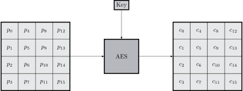

### AES Rounds

### AES Add Round Key

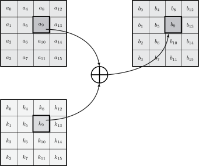

### AES Mix Columns

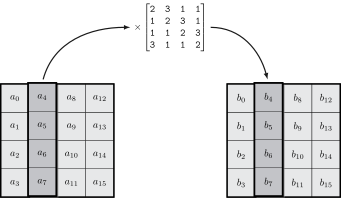

### AES Shift Rows

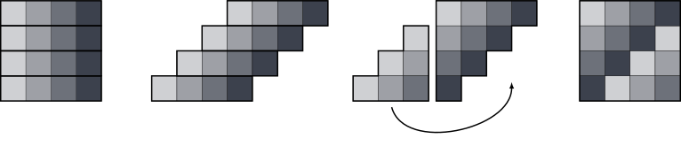

## Conics

### Circle trigonometry

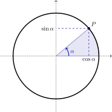

### Circle Addition with Angles

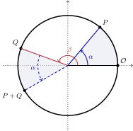

### Circle Addition with Parallels

### Circle Addition Proof

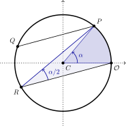

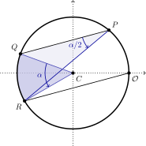

### Circle over a Finite Field

### Circle to a Cubic with a Node

### Hyperbola

### Hyperbola Addition

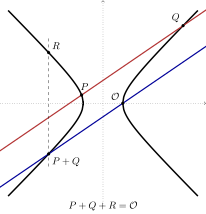

### Hyperbola to a Cubic with a Node

### Parabola

### Parabola to a Cubic with a Cusp

## Elliptic Curves

### Weierstrass Form

### Edwards Form

### Group Law

### Elliptic Curve Addition

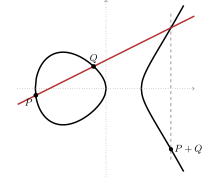

### Elliptic Curve Doubling

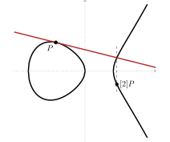

### Elliptic Curve Inverse

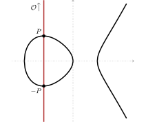

### Singular Cubic Curve (NOT an elliptic curve)

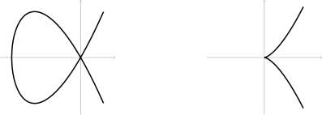

### Apple Scalar Multiplication

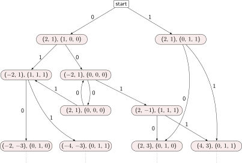

### Projective Coordinates

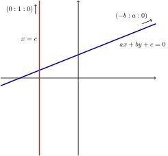

### Projective Parallel Lines

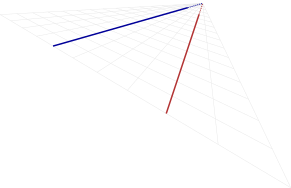

## Others

### Plot

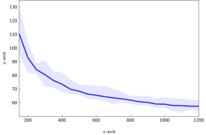

### Pollard Rho

### SRP Protocol

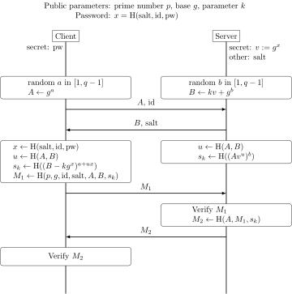

